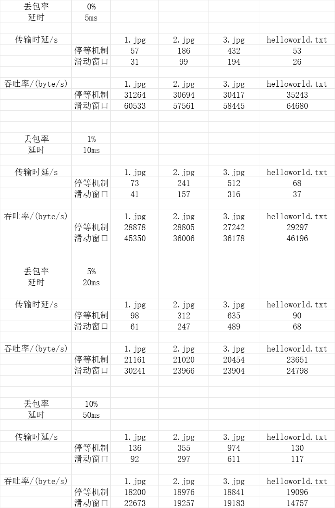
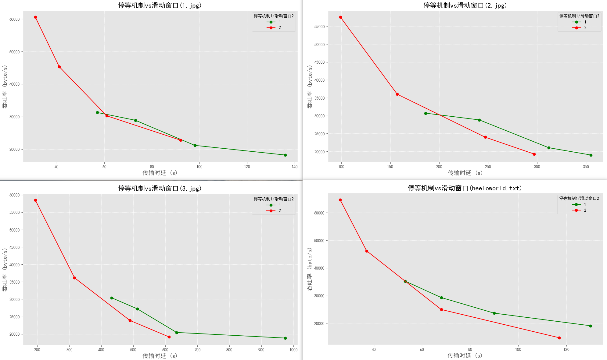
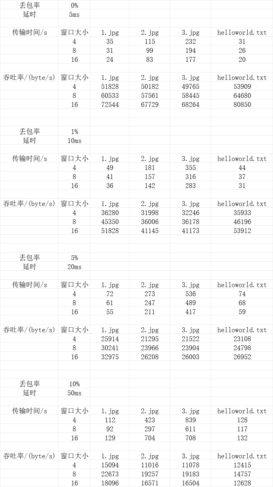
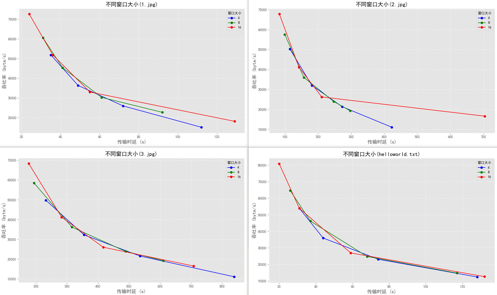
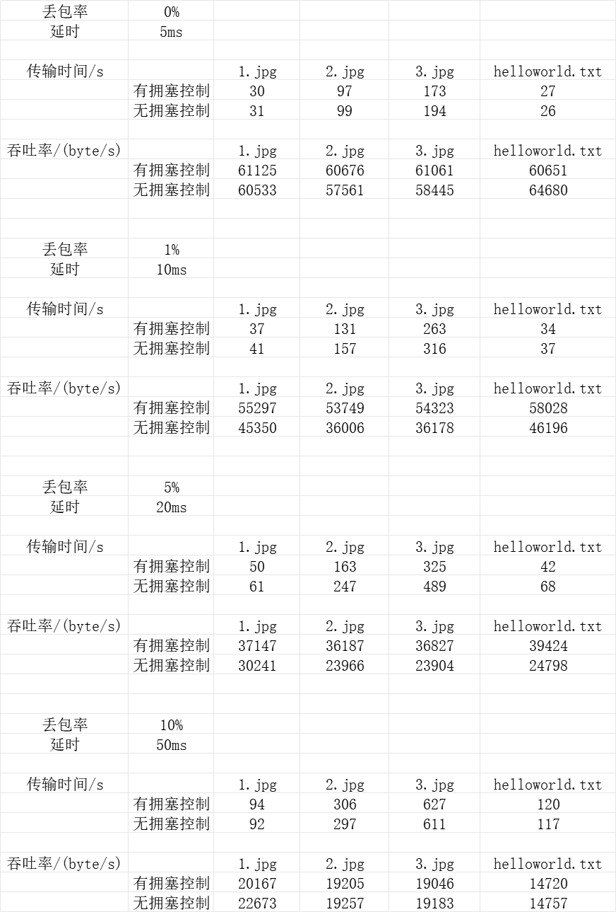
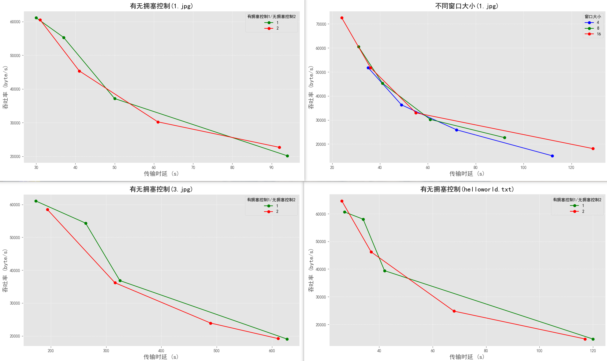

# `Lab3-4`——基于`UDP`服务设计可靠传输协议并编程实现

> **学号：2212452\
姓名：孟启轩\
专业：计算机科学与技术**

## 一、实验要求
实验3-4：基于给定的实验测试环境，通过改变网路的延迟时间和丢包率，完成下面3组性能对比实验：

（1）停等机制与滑动窗口机制性能对比；

（2）滑动窗口机制中不同窗口大小对性能的影响；

（3）有拥塞控制和无拥塞控制的性能比较。

## 二、性能测试

> 设置四组丢包与延时：0% 5ms, 1% 10ms, 5% 20ms, 10% 50ms
收集文件传输时延和吞吐率数据，并分析结果。
#### **(一)停等机制与滑动窗口机制性能对比**

##### 数据如下（其中滑动窗口大小为8）：

**结果分析：**

##### 通过对图表的观察和数据的分析，可以得出以下结论：

##### **1. 滑动窗口机制总体优于停等机制**
- **传输效率方面**：
  - 滑动窗口机制在低丢包率下表现出明显优势，传输时间更短，吞吐率更高。因为滑动窗口允许一次发送多个数据报，充分利用了网络带宽，而停等机制每发送一个数据报都需要等待接收方的确认ACK。
- **RTT影响减少**：
  - 滑动窗口通过批量发送数据减少了每次RTT对传输性能的影响，尤其在低延时和低丢包率场景下效果更为显著。相比之下，停等机制由于必须等待每个ACK，性能受到RTT显著制约。

##### **2. 高丢包率下，停等机制的性能逐渐接近甚至可能优于滑动窗口**
- **高丢包率对滑动窗口的影响**：
  - 滑动窗口机制在高丢包率场景下，较大的窗口意味着更多的数据报可能丢失。一旦发生丢包，必须重传整个窗口范围内的数据报，导致重传开销显著增加。这种情况下，滑动窗口的吞吐率开始下降，传输时间大幅增加。
  
- **停等机制的稳定性**：
  - 停等机制虽然在低丢包率下效率较低，但由于每次只发送一个数据报，即使发生丢包，重传开销较小。这使得停等机制在高丢包率条件下的性能更为稳定，逐渐接近甚至超越滑动窗口机制。

##### **3. 滑动窗口机制的吞吐率在不同延时条件下的变化**
- **低延时场景**：
  - 在低延时条件下（如0%丢包率，5ms延时），滑动窗口能够充分利用网络带宽，显著提升吞吐率。而停等机制由于频繁等待ACK，无法充分利用带宽资源。
  
- **高延时场景**：
  - 在高延时条件下（如10%丢包率，50ms延时），滑动窗口虽然在批量传输中减少了部分RTT影响，但由于ACK的延迟累计以及可能的丢包重传，性能逐渐受限。停等机制在这种情况下表现相对稳定，但整体效率依然低于滑动窗口。

#### **(二)滑动窗口机制中不同窗口大小对性能的影响**

##### 数据如下（其中滑动窗口大小分别为4，8，16）：

**结果分析：**

##### 通过对图表的观察和数据的分析，可以得出以下结论：

##### **1. 总体趋势**
1. **一致性**：
   - 折线图显示，不同窗口大小的性能趋势在各网络条件下总体一致，即在低丢包率场景下，滑动窗口越大，传输效率越高。
   
2. **非线性变化**：
   - 在丢包率逐渐增加的情况下，窗口大小对性能的影响呈现非线性变化。当窗口大小增加到某个临界点后，性能提升开始减缓，甚至出现下降。

##### **2. 网络正常情况下窗口大小对性能的影响**
1. **高效传输**：
   - 在网络状况良好的情况下（低延迟、低丢包率），滑动窗口较大的设置能够同时传输更多数据报，有效减少每次RTT等待时间，提高传输效率。
   
2. **资源利用最大化**：
   - 较大的窗口能够充分利用可用带宽，特别是在高带宽网络中，能够显著提升吞吐率，减少总传输时间。

##### **3. 高丢包率对窗口大小的影响**
1. **窗口越大，重传代价越高**：
   - 在高丢包率条件下，窗口越大，发生丢包时需要重传的数据报数量越多，重传开销显著增加，导致性能下降。

2. **临界窗口效应**：
   - 当丢包率达到一定水平后，窗口大小的增加不仅不能提升效率，反而因过多的重传代价而降低了吞吐率。此时，适当减小窗口大小反而能获得更高的传输效率。

3. **ACK确认延迟的累计效应**：
   - 较大的窗口在高丢包率条件下需要等待更多的ACK确认，而ACK的丢失或延迟会进一步拉低滑动窗口的性能。

#### **(三)有拥塞控制和无拥塞控制的性能比较**

##### 数据如下（其中无拥塞控制滑动窗口大小为8）：

**结果分析：**

##### **1. 总体趋势**
1. **正常网络条件下（低延时和低丢包率）**：
   - 在网络良好时，有拥塞控制的机制整体效率更高，能够更好地利用网络带宽，并减少传输时间。
   - 拥塞控制机制在正常网络下可以动态增大窗口大小，提升吞吐率。

2. **恶劣网络条件下（高延时和高丢包率）**：
   - 当网络条件逐渐变差时，无拥塞控制的机制可能表现出相对稳定的性能，而有拥塞控制的机制由于频繁调整窗口大小，可能导致效率下降甚至低于无拥塞控制。

##### **2. 网络条件与机制性能的关系**

- **拥塞控制的优势**：
  - 拥塞控制机制在网络正常时可以通过拥塞避免算法（如慢启动和拥塞避免阶段）动态扩大窗口大小，充分利用网络资源，减少数据报等待时间。

- **拥塞控制的劣势**：
  - 在高丢包率条件下，有拥塞控制机制会频繁缩小窗口大小，以防止网络进一步拥堵。但由于窗口较小，导致传输过程中需要更多的RTT来完成所有数据的传输，从而增加了传输时间。
  - **窗口调整代价**：
    - 拥塞控制机制可能将窗口从较大的值直接降至1（如丢包超时重传时的慢启动重置），这种频繁的窗口变化导致传输效率急剧下降。

##### **3. 优势与劣势对比**

| **条件**              | **有拥塞控制机制**                      | **无拥塞控制机制**                 |
|-----------------------|---------------------------------------|----------------------------------|
| **网络良好**          | 动态调整窗口，提升传输效率               | 固定窗口，利用率低                |
| **网络恶化**          | 窗口过小，RTT影响大，传输效率降低         | 性能相对稳定，但重传开销大         |
| **网络资源利用率**     | 更高，在网络良好时能充分利用带宽资源       | 固定窗口可能浪费部分带宽资源        |

---
> 另外，多线程确实可以极大地提升传输效率。

## 三、总结与感悟

实验结果表明：滑动窗口机制在低丢包率和低延迟条件下显著优于停等机制，但在高丢包率下其性能因重传代价的增加而下降；窗口大小的调整对滑动窗口性能影响显著，较大的窗口在网络良好时可提升效率，但在高丢包率下可能导致性能下降；有拥塞控制机制在良好网络条件下表现优异，但在恶劣网络条件下，由于频繁调整窗口大小可能导致性能低于无拥塞控制。

本次实验通过改变网络的延迟时间和丢包率，系统地比较了停等机制与滑动窗口机制的性能、滑动窗口机制中不同窗口大小对性能的影响，以及有拥塞控制与无拥塞控制的性能差异。实验深刻揭示了网络传输机制在不同环境中的适用性，强调了机制选择的重要性，对网络协议优化设计具有重要参考价值。

## 四、实验3总结与感悟

**实验3：基于UDP服务设计可靠传输协议并编程实现**到这里已经全部结束，我实现了基于停等机制的可靠数据传输、滑动窗口机制的流量控制以及拥塞控制算法。在实验过程中，我掌握了从用户空间设计面向连接的可靠传输协议的核心技术，如连接建立、差错检测、确认重传等，并通过实验验证了不同机制在网络延迟和丢包率变化条件下的性能差异。实验中也遇到了一些问题，包括协议实现中的ACK丢失处理、窗口调整逻辑以及拥塞控制算法。在解决问题的过程中，我加深了对流量控制和拥塞控制原理的理解，认识到网络协议设计需要在效率与稳定性之间权衡。本次实验不仅提升了我的编程能力和问题解决能力，也让我更加深刻地理解了可靠传输协议在实际网络环境中的重要性。